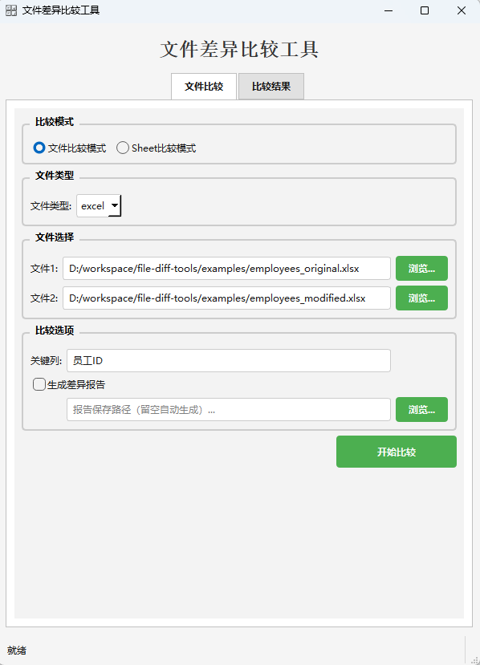
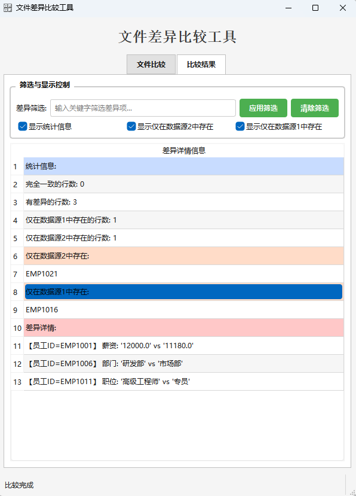

# 文件差异比较工具

[](https://opensource.org/licenses/MIT)
[](https://www.python.org/downloads/)
[](https://www.riverbankcomputing.com/software/pyqt/)

一个基于PyQt6开发的图形界面工具，用于比较Excel、CSV和TXT文件之间的差异。

## 功能特点

- 📊 支持多种文件格式：Excel (.xlsx, .xls)、CSV (.csv)、TXT (.txt)
- 🔄 两种比较模式：文件比较模式和Sheet比较模式
- 🔑 可自定义关键列和分隔符
- 📝 生成详细的差异报告
- 🎨 现代化的用户界面设计
- ⚡ 多线程处理，避免界面卡顿

## 截图




## 安装

### 环境要求

- Python 3.7+
- windows环境

### 安装和使用方法

#### 方法1：直接下载（推荐）

1. 下载最新版本的压缩包（里面包含测试文件和exe程序）
2. 下载最新的exe程序直接运行

#### 方法2：克隆仓库

```bash

git clone https://github.com/linux-dxr/file-diff-tools.git
cd file-diff-tools
pip install -r requirements.txt
python main.py或者python file_diff_gui.py
```

### 文件比较模式

1. 选择"文件比较模式"
2. 选择要比较的两个文件
3. 输入用于匹配行的关键列名
4. 根据文件类型设置分隔符（CSV和TXT文件需要）
5. 选择是否生成差异报告
6. 点击"开始比较"按钮

### Sheet比较模式

1. 选择"Sheet比较模式"
2. 选择第一个文件（可以是Excel文件中的任意Sheet）
3. 选择包含多个Sheet的Excel文件
4. 从下拉菜单中选择要比较的两个Sheet
5. 输入用于匹配行的关键列名
6. 点击"开始比较"按钮

## 比较结果

比较完成后，可以在"比较结果"选项卡中查看：

- ✅ 完全一致的行数
- ❌ 有差异的行数
- ➕ 仅在数据源1中存在的行数
- ➖ 仅在数据源2中存在的行数
- 📋 详细的差异数据

如果选择了生成差异报告，报告将保存在指定路径或自动生成的路径中。

## 示例

### 示例1：比较两个Excel文件

```python
from file_diff import two_file_diff

# 比较两个Excel文件
result = two_file_diff(
    file1_path="data1.xlsx",
    file2_path="data2.xlsx",
    key_column="ID",
    output_report=True,
    report_path="diff_report.csv"
)
```

### 示例2：比较同一Excel文件中的两个Sheet

```python
from file_diff import two_file_diff

# 比较同一Excel文件中的两个Sheet
result = two_file_diff(
    compare_mode="sheet",
    file_path_for_sheet="data.xlsx",
    sheet1="Sheet1",
    sheet2="Sheet2",
    key_column="ID",
    output_report=True
)
```

### 示例3：比较两个CSV文件

```python
from file_diff import two_file_diff

# 比较两个CSV文件
result = two_file_diff(
    file1_path="data1.csv",
    file2_path="data2.csv",
    key_column="ID",
    file_type="csv",
    delimiter=",",
    output_report=True
)
```

## 注意事项

- 比较时需要确保两个数据源都包含指定的关键列
- Sheet比较模式仅支持Excel文件
- 报告文件使用CSV格式，但包含注释信息
- 比较大文件时可能需要一些时间，请耐心等待

### 贡献

欢迎贡献代码！请查看 [CONTRIBUTING.md](CONTRIBUTING.md) 了解详细信息。

## 更新日志

### v1.0.0 (2025-12-08)

- 初始版本发布
- 支持Excel、CSV、TXT文件比较
- 实现文件比较模式和Sheet比较模式
- 添加差异报告生成功能
- 实现图形用户界面

## 许可证

本项目采用 [MIT许可证](LICENSE)。

## 联系方式

- 项目主页: https://github.com/linux-dxr/file-diff-tools
- 问题反馈: https://github.com/linux-dxr/file-diff-tools/issues
- 邮箱: d19091730135@gmail.com
